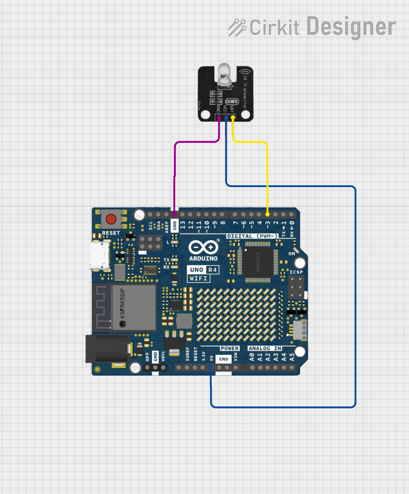

# IRext Arduino Example

This is a simple example of how to use IRext with an Arduino UNO R4.

Please follow the diagram below to connect the IR transmitter module to your Arduino or use a breadboard, IR LED and MOSFET.



## Connect to Wi-Fi

The project uses WiFiS3 library to connect the Arduino UNO R4 WiFi to your local network. You need to configure your WiFi credentials in [src/configure.h](src/configure.h):

```cpp
#define SECRET_SSID "your_wifi_ssid"
#define SECRET_PASS "your_wifi_password"
```

The Arduino connects as a WiFi client (station mode) and starts a TCP server on port 8000 to communicate with external devices, typically an Android application.

## Use TCP Server Socket to Communicate with Android APP

The Arduino runs a TCP server on port 8000 that handles communication with an Android application. The communication protocol includes:

- Hello handshake: [a_hello](src/main.cpp#L32) command initiates connection, responded with [e_hello](src/main.cpp#L33)
- Binary transmission: [a_bin](src/main.cpp#L34) command sends IR binary data, responded with [e_bin](src/main.cpp#L35)
- Control commands: [a_control](src/main.cpp#L36) command sends IR control commands, responded with [e_control](src/main.cpp#L37) or success/failure indicators
- Error handling: [a_error](src/main.cpp#L38) command triggers error response [e_error](src/main.cpp#L39)

The communication is bidirectional - the Android app sends commands to control the IR transmission, and the Arduino responds with status updates.

## Receive IR Binary and Open with IR Decode API

The system receives encoded IR binary data via the TCP protocol. The binary data is Base64-encoded and transmitted in the format:
`a_bin,[categoryId],[subCategoryId],[length],[binary_data_base64]`

The system decodes the Base64 data and loads it into the IR decoding engine using the `ir_binary_open()` function. This prepares the system to handle specific IR protocols for different device types (air conditioners, TVs, etc.).

## Receive IR Control Command, Decode and Transmit

When a control command is received in the format:
`a_control,[length],[command_json_base64]`

The system:
1. Decodes the Base64-encoded JSON command
2. Parses the control parameters (temperature, power state, modes, etc.)
3. Uses the IR decode API to generate the appropriate raw IR signal data
4. Transmits the IR signal using the IRremote library on pin 3

The system supports various IR protocols and device types through its modular decoder architecture located in the [src/ir_decode](src/ir_decode) directory.


## Related Links

- IRext Official Site: https://irext.net
- IRext Documentation: https://site.irext.net/doc
- IRext GitHub: https://github.com/irext

## License

Please refer to the IRext repository for license information.